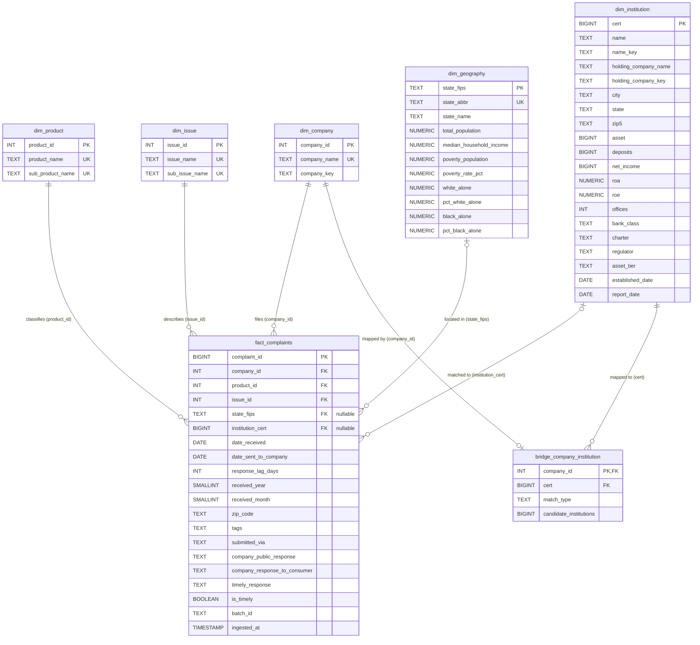

```mermaid
erDiagram
    dim_company ||--o{ fact_complaints : "files (company_id)"
    dim_product ||--o{ fact_complaints : "classifies (product_id)"
    dim_issue ||--o{ fact_complaints : "describes (issue_id)"
    dim_geography |o--o{ fact_complaints : "located in (state_fips)"
    dim_institution |o--o{ fact_complaints : "matched to (institution_cert)"
    dim_company ||--o| bridge_company_institution : "mapped by (company_id)"
    dim_institution ||--o{ bridge_company_institution : "mapped to (cert)"

    fact_complaints {
        BIGINT complaint_id PK
        INT company_id FK
        INT product_id FK
        INT issue_id FK
        TEXT state_fips FK "nullable"
        BIGINT institution_cert FK "nullable"
        DATE date_received
        DATE date_sent_to_company
        INT response_lag_days
        SMALLINT received_year
        SMALLINT received_month
        TEXT zip_code
        TEXT tags
        TEXT submitted_via
        TEXT company_public_response
        TEXT company_response_to_consumer
        TEXT timely_response
        BOOLEAN is_timely
        TEXT batch_id
        TIMESTAMP ingested_at
    }
    dim_company {
        INT company_id PK
        TEXT company_name UK
        TEXT company_key
    }
    dim_product {
        INT product_id PK
        TEXT product_name UK
        TEXT sub_product_name UK
    }
    dim_issue {
        INT issue_id PK
        TEXT issue_name UK
        TEXT sub_issue_name UK
    }
    dim_geography {
        TEXT state_fips PK
        TEXT state_abbr UK
        TEXT state_name
        NUMERIC total_population
        NUMERIC median_household_income
        NUMERIC poverty_population
        NUMERIC poverty_rate_pct
        NUMERIC white_alone
        NUMERIC pct_white_alone
        NUMERIC black_alone
        NUMERIC pct_black_alone
    }
    dim_institution {
        BIGINT cert PK
        TEXT name
        TEXT name_key
        TEXT holding_company_name
        TEXT holding_company_key
        TEXT city
        TEXT state
        TEXT zip5
        BIGINT asset
        BIGINT deposits
        BIGINT net_income
        NUMERIC roa
        NUMERIC roe
        INT offices
        TEXT bank_class
        TEXT charter
        TEXT regulator
        TEXT asset_tier
        DATE established_date
        DATE report_date
    }
    bridge_company_institution {
        INT company_id PK, FK
        BIGINT cert FK
        TEXT match_type
        BIGINT candidate_institutions
    }
```